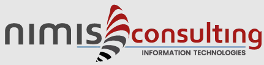

# WebLogic Configuration & Application Migration Tool

<p align="center">
  
</p>

<p align="center">
  <b>Version 3.8.0 (FlatLaf Gold)</b> | Sviluppatore: <i>Alessandro Caliciotti</i> | <b>Nimis Consulting Information Technologies</b>
</p>

---

## 📖 Documentazione Rapida & Link Utili

- 📖 **[Guida Utente Operativa Passo-Passo](GUIDA_UTENTE.md)** - Manuale utente completo per l'utilizzo dell'applicazione, gestione dei lavori, mappature ed esportazione.
- 📚 **[Wiki del Progetto & Architettura Tecnica](WIKI.md)** - Documentazione approfondita sull'architettura interna, MBean WebLogic, Jython AST e partizionamento anti-64KB.

---

## 🌐 Language / Lingua

- 🇮🇹 [Italiano](#-italiano)
- 🇬🇧 [English](#-english)

---

## 🇮🇹 Italiano

### 📌 Panoramica del Software
Il **WebLogic Migration Tool** è una soluzione software enterprise progettata per automatizzare l'estrazione, la migrazione e la replicazione della topologia e delle applicazioni fra ambienti **Oracle WebLogic Server (11g/12c)**.

Il tool gestisce l'intero ciclo di vita della migrazione: dall'estrazione remota via SSH con decifrazione automatica delle password dei DataSources JDBC, alla ri-mappatura grafica di nomi, porte e credenziali, fino all'installazione remota dei pacchetti applicativi (`.war`, `.ear`, `.jar`) e delle Librerie Condivise (`Shared Libraries`).

#### ✨ Caratteristiche Principali (v3.8.0):
1. 💻 **Avvio sempre a Schermo Intero**:
   - L'applicazione si avvia automaticamente massimizzata (`MAXIMIZED_BOTH`) per la massima visibilità delle griglie e dei diagrammi.
2. 📂 **Gestione Lavori Standalone (`works/`)**:
   - Organizzazione del lavoro in cartelle dedicate (`works/001_xxx`) contenenti `dump/`, `deploy/`, `target_dumps/` e `prj_saves/`.
3. 🧠 **Gestione Intelligente delle Machine**:
   - **Eliminazione Intelligente**: Rileva le risorse collegate (Server, NodeManager) alla Machine in eliminazione proponendo il popup modale per la riassegnazione prima della cancellazione.
   - **Consolida Machine**: Caselle di testo precompilate per ciascuna Machine rilevata per la rinomina globale in 1-click.
   - **Aggiungi Machine**: Finestra dedicata per creare nuove Machine target e selezionare le risorse da associarvi tramite checkbox.
4. 🔀 **Validazione Mappature Multi-Target & Modal Interattivo**:
   - Supporto nativo ai target multipli separati da virgola (es. `cluster1,cluster2,server1`) senza falsi positivi.
   - Modal interattivo **`🔧 Correzione Mappature Non Valide`** con tabella delle sole righe errate a sinistra ed **Ispettore Proprietà Elemento** a destra per la correzione guidata e la sincronizzazione con la griglia principale.
5. 🔄 **Popolamento Automatico & Viste Grafiche**:
   - Aggiornamento istantaneo ed automatico dell'Albero di Gerarchia Target e della Vista Architetturale a Blocchi.
6. 🔍 **Zoom & Esportazione Schermata PNG**:
   - Controlli **Zoom In (+)**, **Zoom Out (-)**, **100%** e pulsante **`📸 SALVA SCHERMATA (PNG)`** per salvare l'immagine HD dell'architettura.
7. 🔐 **Estrazione SSH & Decifrazione Password JDBC**:
   - Decifrazione automatica delle password offuscate `XMLEncryptionSecret` direttamente dai file `config.xml` sorgente.
8. 📦 **Robustezza WLST & Anti-JVM 64KB Limit**:
   - Partizionamento degli script Python generati in lotti da 15 elementi per evitare limiti di bytecode JVM.

---

### 🚀 Istruzioni per l'Installazione ed Avvio

1. **Clonare il Repository**:
   ```bash
   git clone https://github.com/RedScorpio83/weblogic-migration-tool-dist.git
   cd weblogic-migration-tool-dist
   ```
2. **Avvio su Windows**:
   Fare doppio click sul file `run.cmd` (oppure eseguire da terminale: `run.cmd`).
3. **Avvio su Linux / macOS**:
   ```bash
   chmod +x run.sh
   ./run.sh
   ```

---

## 🇬🇧 English

### 📌 Software Overview
**WebLogic Migration Tool** is an enterprise software platform designed to extract, migrate, and replicate topology and applications between **Oracle WebLogic Server (11g/12c)** environments.

- **Documentation**: Read the complete **[User Guide (GUIDA_UTENTE.md)](GUIDA_UTENTE.md)** and **[Technical Wiki (WIKI.md)](WIKI.md)** for further operational and architectural details.

---
*Developed by Alessandro Caliciotti - Nimis Consulting Information Technologies*
