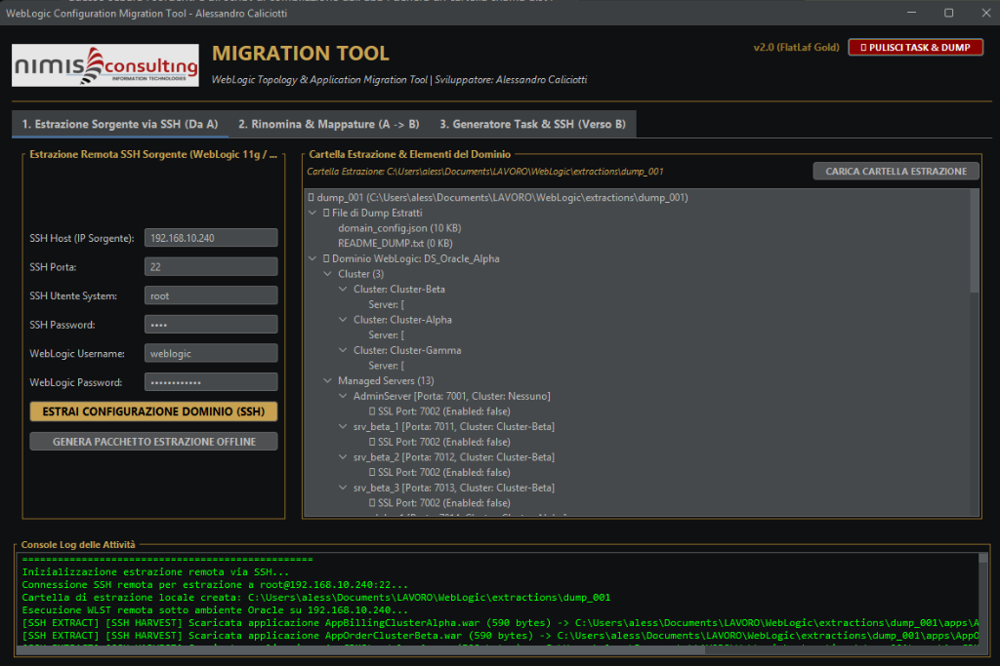
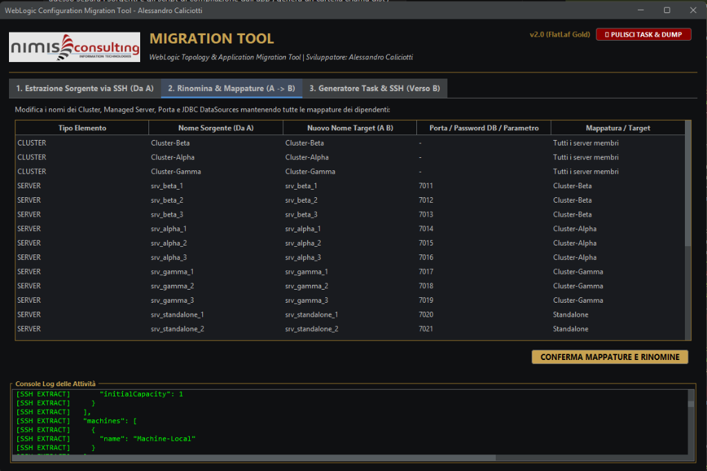
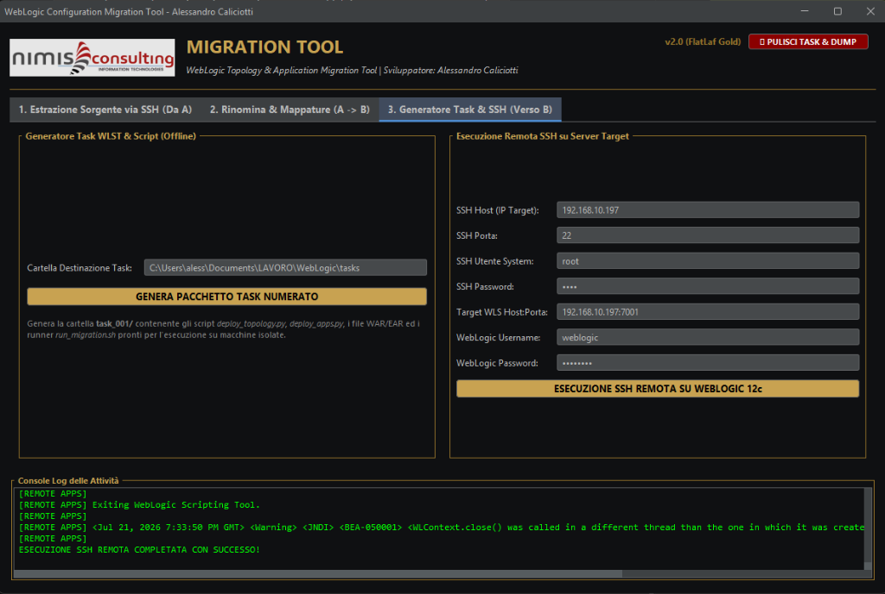

# WebLogic Configuration & Application Migration Tool - Official Documentation Wiki

<p align="center">
  
</p>

---

## 📚 Table of Contents / Indice

- 🇮🇹 **[Guida Utente Italiana](#-guida-utente-italiana)**
  1. [Introduzione ed Architettura](#1-introduzione-ed-architettura)
  2. [Flusso Operativo Passo-Passo](#2-flusso-operativo-passo-passo)
  3. [Gestione delle Applicazioni e Decifrazione Password](#3-gestione-delle-applicazioni-e-decifrazione-password)
  4. [Risoluzione Problemi e Domande Frequenti (FAQ)](#4-risoluzione-problemi-e-domande-frequenti-faq)
- 🇬🇧 **[English User Guide](#-english-user-guide)**
  1. [Introduction & Architecture](#1-introduction--architecture)
  2. [Step-by-Step Workflow](#2-step-by-step-workflow)
  3. [Application Harvesting & Password Decryption](#3-application-harvesting--password-decryption)
  4. [Troubleshooting & FAQ](#4-troubleshooting--faq)

---

## 🇮🇹 Guida Utente Italiana

### 1. Introduzione ed Architettura

Il **WebLogic Configuration & Application Migration Tool** è stato sviluppato da **Alessandro Caliciotti** per **Nimis Consulting Information Technologies** per automatizzare la migrazione completa dei domini Oracle WebLogic.

```
+--------------------------+        SSH / Offline Dump         +---------------------------+
| WebLogic 11g (Sorgente)  | --------------------------------> | WebLogic Migration Tool   |
| IP: 192.168.10.240       |                                   | (GUI FlatLaf Gold)        |
+--------------------------+                                   +---------------------------+
                                                                             |
                                                                             | Deploy Remoto / Task
                                                                             v
                                                               +---------------------------+
                                                               | WebLogic 12c (Target)     |
                                                               | IP: 192.168.10.197       |
                                                               +---------------------------+
```

---

### 2. Flusso Operativo Passo-Passo

#### Scheda 1: Estrazione Sorgente via SSH (Da A)
In questa fase si effettua la scansione remota del server WebLogic 11g sorgente.



- **Parametri da Inserire**:
  - `SSH Host`: Indirizzo IP del server sorgente (es. `192.168.10.240`).
  - `SSH Porta`: Porta SSH (Default: `22`).
  - `SSH Utente System`: Utente di sistema Linux con permessi di lettura sul dominio Oracle (es. `root` o `oracle`).
  - `SSH Password`: Password dell'utente SSH.
  - `WebLogic Username/Password`: Credenziali dell'AdminServer sorgente (es. `weblogic` / `Weblogic123!`).

- **Estrazione Offline per Server Isolati**:
  Cliccando su **`GENERA PACCHETTO ESTRAZIONE OFFLINE`**, il tool crea una cartella `extractions_tools/dump_tool_xxx/` contenente:
  - `extract_domain.py`: Script WLST standalone.
  - `run_extraction.sh`: Runner Linux Bash.
  - `run_extraction.cmd`: Runner Windows CMD.
  - `apps/`: Cartella pre-creata per raccogliere i file `.war` / `.ear`.

---

#### Scheda 2: Rinomina & Mappature (A -> B)
In questa scheda è possibile personalizzare ed adattare l'ambiente sorgente prima di ricrearlo sul target.



- **Modifica della Tabella**:
  - `Tipo Elemento`: `CLUSTER`, `SERVER`, `JDBC DATASOURCE`, `APPLICAZIONE`.
  - `Nuovo Nome Target`: Consente di rinominare gli elementi (es. da `srv_beta_1` a `srv_beta_new_1`).
  - `Porta / Password DB`: Consente di modificare la porta di ascolto (es. `7011`) o inserire la password reale del database per i DataSources JDBC.
  - `Mappatura / Target`: Consente di riassegnare il Cluster di appartenenza per ciascun server o applicazione.

---

#### Scheda 3: Generazione Task & Deploy Remoto (Verso B)
In questa scheda si esegue la migrazione reale sul server WebLogic 12c target.



- **Parametri Target SSH**: Inserisci l'IP target (`192.168.10.197`), la porta SSH, l'utente `root`, le credenziali WebLogic 12c ed avvia l'esecuzione con il pulsante **`ESECUZIONE SSH REMOTA SU WEBLOGIC 12C`**.
- **Pulsante `PULISCI TASK & DUMP`**: Posizionato in alto a destra, permette di azzerare lo storico delle cartelle `extractions`, `extractions_tools` e `tasks` per iniziare un nuovo lavoro pulito.

---

### 3. Gestione delle Applicazioni e Decifrazione Password

#### Decifrazione delle Password JDBC
Durante l'estrazione SSH, il tool esegue in remoto un modulo Jython/WLST che carica la chiave master di cifratura `SerializedSystemIni.dat` ed utilizza l'API Oracle `weblogic.security.internal.serialized.SerializedSystemIni` e `ClearOrEncryptedService` per restituire in chiaro le password dei DataSources JDBC.

#### Harvesting Applicativo (`getSourcePath`)
Ogni applicazione registrata nel dominio sorgente viene identificata tramite la proprietà MBean `getSourcePath()`. Il tool scarica automaticamente via SSH i file fisici (`.war`, `.ear`, `.jar`) posizionandoli nella cartella `extractions/dump_xxx/apps/` ed uploadandoli in `/tmp/apps/` sul target durante il deploy.

---

### 4. Risoluzione Problemi e Domande Frequenti (FAQ)

- **Q: Il tool richiede Java installato sul PC su cui gira la GUI?**
  - **R**: No, il pacchetto include una JDK 17 portabile integrata che si auto-inizializza al primo lancio via `run.cmd` o `run.sh`.
- **Q: Come risolvere errori WLST `NameError: __file__`?**
  - **R**: Gli script generati utilizzano la risoluzione dinamica del percorso `script_dir = os.getcwd()` compatibile con Jython 2.2 e 2.7.

---

<br/>

## 🇬🇧 English User Guide

### 1. Introduction & Architecture

The **WebLogic Configuration & Application Migration Tool** was created by **Alessandro Caliciotti** for **Nimis Consulting Information Technologies** to fully automate Oracle WebLogic domain migration.

---

### 2. Step-by-Step Workflow

#### Tab 1: Source SSH Extraction (From A)
Performs remote scanning of the source WebLogic 11g server.


- Input source IP, SSH credentials, and WebLogic credentials.
- Click **"ESTRAI CONFIGURAZIONE DOMINIO (SSH)"** to launch background extraction with the **Apple-style Gold Leaf loading overlay**.

#### Tab 2: Renaming & Mapping (A -> B)
Allows customizing the source topology prior to target deployment.


- Edit Cluster/Server names, reassigned listen ports, update JDBC passwords, and remap target Clusters.

#### Tab 3: Task Generator & Remote Execution (To B)
Deploys the configuration and applications to WebLogic 12c.


- Enter target SSH and WebLogic 12c credentials and click **"ESECUZIONE SSH REMOTA SU WEBLOGIC 12C"** to execute end-to-end migration.

---

### 3. Application Harvesting & Password Decryption

- **JDBC Password Decryption**: Automatically retrieves cleartext passwords by invoking WebLogic security services (`ClearOrEncryptedService`) on the source AdminServer.
- **WAR/EAR Harvesting**: Automatically downloads application binary files into `apps/` and uploads them to `/tmp/apps/` on target WebLogic 12c.

---

### 4. Troubleshooting & FAQ

- **Q: Does the GUI require Java installed on the client machine?**
  - **A**: No, the distribution package includes a portable OpenJDK 17 runtime that auto-initializes via `run.cmd` or `run.sh`.
